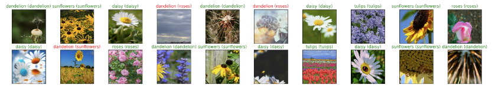

# Flower Image Classification

### Overview

A flower image classifier built using transfer learning with a pre-trained [VGG16](https://neurohive.io/en/popular-networks/vgg16/) neural network.

### Jupyter Notebook

See the Jupyter notebook here: [flower_image_classifier_transfer_learning_exercise.ipynb](flower_image_classifier_transfer_learning_exercise.ipynb)

### Results

### References

This exercise was part of the [Udacity Deep Learning / ML nanodegree](https://www.udacity.com/course/deep-learning-nanodegree--nd101).
